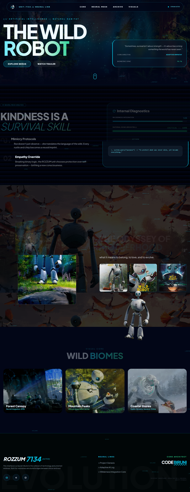

# 🤖 THE WILD ROBOT | Neural Evolution Experience



> *"Sometimes, survival isn't about strength — it's about becoming something the world has never seen."*

[](https://your-demo-link.com)
[](https://greensock.com/gsap/)
[](https://threejs.org/)
[](https://tailwindcss.com/)

---

## 📖 About The Project

**The Wild Robot** is an immersive, cinematic landing page experience inspired by the beloved story of ROZZUM unit 7134 (Roz). This interactive web experience blends cutting-edge web technologies to tell the story of a robot who discovers that kindness and empathy are the ultimate survival skills.

### ✨ Key Features

- 🎨 **Stunning Visual Effects** - 3D particle background with Three.js
- 🎬 **Smooth Animations** - GSAP ScrollTrigger powered storytelling
- 🤖 **Interactive Robot Character** - Animated ROZZUM unit that guides you through the narrative
- 📱 **Fully Responsive** - Optimized for all device sizes
- 💫 **Floating Data Streams** - Cyberpunk-inspired UI elements
- 📖 **3D Book Effect** - Interactive cover animation on scroll
- 🎯 **Scroll-Triggered Animations** - Every section reveals with purpose

---

## 🛠️ Built With

| Technology | Purpose |
|------------|---------|
|  | Structure & Semantics |
|  | Styling & Responsive Design |
|  | Scroll Animations & Timeline |
|  | 3D Particle Background |
|  | Interactivity & Logic |

---

## 📁 Project Structure
the-wild-robot/
│
├── index.html # Main HTML file
├── README.md # Project documentation
├── 1.png # Banner image for README
│
├── image/ # Image assets directory
│ ├── robot.png # Main ROZZUM character
│ ├── logo.png # Website logo & favicon
│ ├── banner-bg.png # Hero section background
│ ├── cover.jpg # Book cover image
│ ├── bg1.webp # Story section background
│ ├── galley1.jfif # Gallery image 1
│ ├── gallery2.webp # Gallery image 2
│ ├── gallery3.jpg # Gallery image 3
│ ├── card1.jfif # Biome card 1
│ ├── card2.jpeg # Biome card 2
│ └── card3.webp # Biome card 3
│
└── assets/ # (Optional) Additional assets


---

## 🚀 Getting Started

### Prerequisites

- Any modern web browser (Chrome, Firefox, Safari, Edge)
- Local server (optional - for best performance)

### Installation

1. **Clone the repository**
   ```bash
   git clone https://github.com/your-username/the-wild-robot.git
   cd the-wild-robot

   
